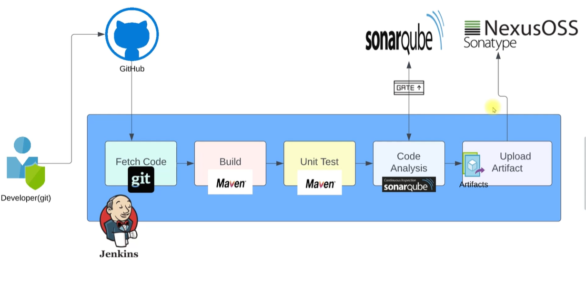
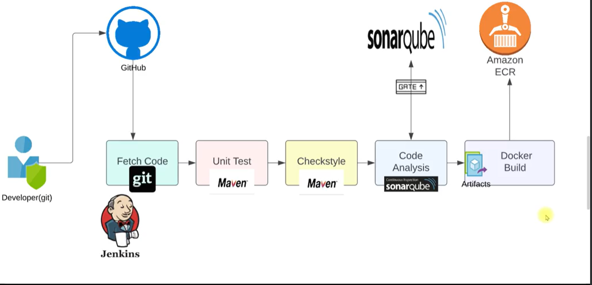
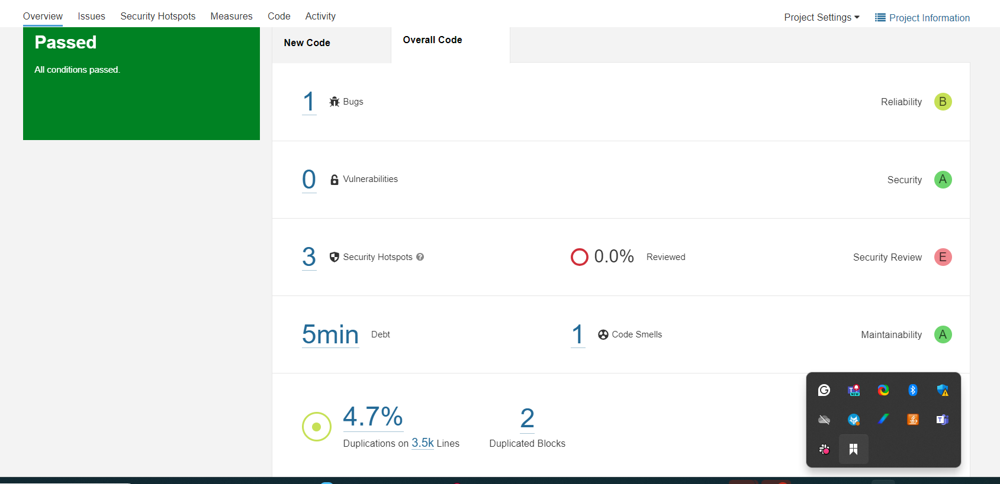
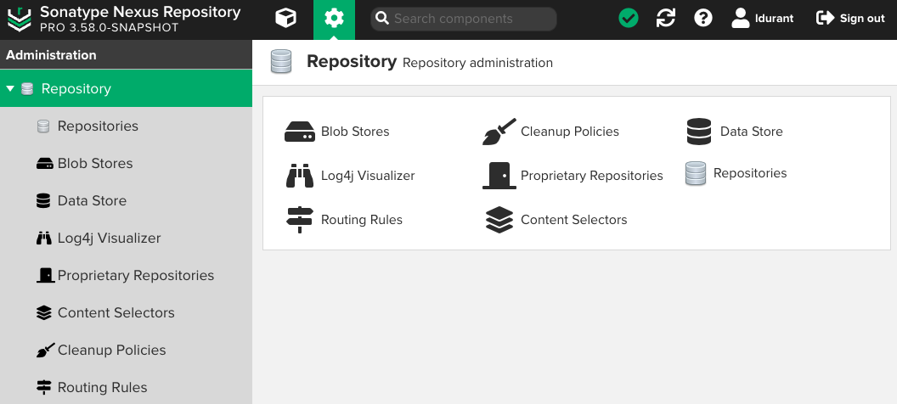
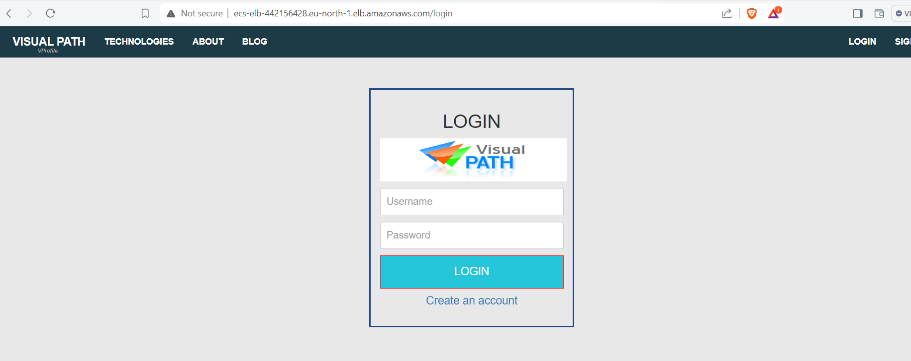

# CICD PIPELINE WITH SONARQUBE, NEXUS, DOCKER, ERS, ECS USING JENKINS CI ENGINE

1. JENKINS CI with SONARQUBE AND NEXUS 



From the design, developer uses Git on his work station to push code to GitHub, Jenkis fetch the code from github, since the code is java base, Apache Maven plugin is used to build and run unit test on the code for functionslity. 

Sonarqube installed on another server, with the sonar-scanner plugin is installed on jenkins to run the scan on jenkins server. It runs code analysis on the code, to get a quality code, but does not test for functionalities. Sonarqube is similar to artfactory X-ray

While Nexus is install on a server, with nexus plugin installed in jenkins, what nexus do is to receive the built artifact from jenkins which could be .jar or .war or .zip depending on the language used to write the code. Nexus is similar to artifactory Jfrog


2. JENKINS CICD with SONARQUBE, DOCKER ELASTIC CONTAINER RESGISTRY (ECR) AND ECS



From the design, developer uses Git on his work station to push code to GitHub, Jenkis fetch the code from github, since the code is java base, Apache Maven plugin is used to build and run unit test on the code for functionslity. 

Sonarqube installed on another server, with the sonar-scanner plugin is installed on jenkins to run the scan on jenkins server. It runs code analysis on the code, to get a quality code, but does not test for functionalities. Sonarqube is similar to artfactory X-ray

The only difference here is that I replace Nexus part with Docker build and save the docker image to Amazon ECR, which is similar to docker registry hub.

## PROJECT DEPLOYMENT

1. Create 1 AWS EC2 instances for jenkins server,(Ubuntu, t2.micro)
   Install jenkins and install all the default plugins. Use the this [link](https://www.jenkins.io/doc/book/installing/linux/#debianubuntu) to install the latest version jenkins. 

   **Note:** First install java from the same site, then install the Long Term Support release of Jenkins.

2. Create 1 AWS EC2 instances for Sonarqube server,(Ubuntu, t2.medium). To install sonarqube I used the following [tscript](sonarqube.sh), although, manual way can be found on the ower's [website](https://docs.sonarsource.com/sonarqube/latest/setup-and-upgrade/install-the-server/introduction/).

Next is to install sonar-scanner plugin in jenkins and then set it up in jenkins systems configuration, and to setup quality gateway, token will be created in sonar GUI.

3. Create 1 AWS EC2 instances for Nexus server,(Redhat or centOS, t2.medium), use the following [script](Nexus.sh) to install.
After successful installation, go to jenkins and install Nexus Artifact Uploader.

Please remember for jenkins to have access to both the sonarqube and nexus server, their credentials must be set up under Jjenkins credential.

The following plugins were also installed to achieve a successful pipeline build.
* Build Timestamp
* Pipeline Utility Steps
* Pipeline Maven Integration
* pipeline utility check

### SONARQUBE

What is code quality?
* Is it bug free
* Is it secure?
* Is duplication avoided
* Is the code tested properly?
* Is kind of complex?
* Is it easy to integrate it with others code?

STATIC CODE ANALYSIS TOOLS
* sonaQube
* coverity
* veracode
* codescene
* raxis

**sonaQube**
It acts as Quality Management Tool
* Code Analysis
* Test Reports
* Code Coverage

**Manual installation of Sonar-scaner on Redhat server**

Download link: wget https://binaries.sonarsource.com/Distribution/sonar-scanner-cli/sonar-scanner-cli-5.0.1.3006-linux.zip?_gl=1*ywk0as*_gcl_au*MTk3MjYzOTcyNS4xNzA5NTQ4MTIy*_ga*MTQ0MDg0NTEwMy4xNzA5NTQ4MTI2*_ga_9JZ0GZ5TC6*MTcxMDA0NTIwMC40LjEuMTcxMDA0NTc4OC40NC4wLjA.

```markdown
unzip sonar-scanner-cli-5.0.1.3006-linux.zip
vi ~/.bashrc
export PATH=$PATH:/home/ec2-user/sonar-scanner/bin
source ~/.bashrc
sonar-scanner -h
```

**Jenkins Pipeline Concept**

* Pipeline
* Node/Agent
* Stages
* Step

pipeline {
    agent any
    stages {
        stage('Build') {
            steps {
                //
            }
        }
        stage('Test') {
            steps {
                //
            }
        } 
        stage('Deploy') {
            steps {
                //
            }
        }  
        
    }
}

The full concept
pipeline {

    agent {

    }

    tools {  
        Mention names of tools like sonar scanner, nexus, maven
    }

    environment {
        Define environment variable if need be
    }

    stages {
        Inside stages you can have steps and posts
    }

}

With the above jenkins file concept, the following Jenkinsfile were used for both Sonarqube and Nexus 
[Jenkinsfile](Jenkinsfile)

**Sonar server GUI output:**



**Nexus server GUI output:**




## ADDING DOCKER AND AWS ELASTIC REGISTRY SERVICE TO OUR CI SETUP WITH JENKINS

**What we need for registry:**
* IAM user with ECR permission
* Programmatic Access credential
* ECR repos in AWS
* Registryurl/registry name

Note that the building will be done in the docker image

**Plugins:** 
* Docker pipeline plugin
* Docker engine on jenkins
* ECR plugin

### Docker CI in Jenkins

* Install docker engine in jenkins server
    * Add jenkins user to docker group and reboot (usermod -aG docker jenkins)
* Install AWS cli, though not need in CI but will be useful CD
* Create IAM User
* Create ECR repo
* Plugins 
    * ECR, Docker pipeline, AWS sdk for credentials, cloudbees docker build and publish
* Store AWS credential in jenkins
* Run the pipeline

**The following is the docker part of the Jenkinsfile:**

```markdown
stage('Build App Image') {
            steps {
                script{
                    dockerimage = docker.build( appRegistry + ":$BUILD_NUMBER", "Docker-files/app/multistage/")
                }
            }
        }
```


**ECR**:

To create ECR repo, I have to login to AWS console, create the repository first and take note of the following about the repo, and these information will be use in the Jenkins pipeline:

* Repo name
* Repo URL
The following is the ECR part of Jenkinsfile:

```markdown
stage('Upload App Image') {
            steps {
                script {
                    // dockerimage = docker.build("dockerimage:${BUILD_NUMBER}")
                    docker.withRegistry( vprofileRegistry, registryCredential ) {
                        dockerimage.push("${BUILD_NUMBER}")
                        dockerimage.push('latest')
                    }
                }
            }

            post {
                success {
                    echo 'Image pushed to registry'
                }
            }
        }

```
### THE CD PART OF THE CICD PIPELINE

**pugin:** awscli, pipeline aws step

* In this part, the CD is manual, I have to login to AWS Elastic container Service (ECS) console to create ECS cluster, task and service.
From the task, I manually pulled the image from the ECR, then through the service, I was able to access the container websesite through the Elastic load balancer URL.

* For continues delivery CD, ECS was also introduce into jenkins pipeline. This is done so that, when there is a change in code, no need to manually update the container, ones there is a built from Jenkins, the container is automatically updated with the new version.

* The followings are the ECS part of the Jenkinsfile:

```markdown
stage('container run') {
            steps {
                withAWS(credentials: 'awscred', region: 'eu-north-1') {
                    sh 'aws ecs update-service --cluster ${cluster} --service ${service} --force-new-deployment'
                }
            }
        }

```
Also the entire Jenkinsfile is [here](Jenkinsfile-docker)

**The final project website:**




## Popular Jenkins Job Trigger

* **Git Webhook:** Configure on github repository, and triggers build whenever there is a change in the repository
* **Poll SCM:** Check github repo for changes base on specified time
* **Scheduled jobs:** Similar to poll scm
* **Remote triggers:** Allow you trigger from anywhere
* **Build after other projects are built**

**SCM option makes it possible for us to use jenkinsfile in remote github account.**

**Remote triggers:**

If you are using windows, you will need to download and install wget as follows:
To to use wget on gitbash: visit [here](https://eternallybored.org/misc/wget/), then copy to the following part: "C:\Program Files\Git\mingw64\bin\"

**Remote trigger format:**

**Job url:** ```markdown
JENKINS_URL/job/jenkinsfile-pipeline/build?token=TOKEN_NAME 
http://16.171.37.142:8080/job/jenkinsfile-pipeline/build?token=boma-token

```
**Token from jenkins user:**
```markdown
admin:110d6f82817def747e2cb80f58c933aef6
```

**CRUMB:** It is the wget command that we ran in any of the windows terminal that give us the CRUM

```markdown
wget --auth-no-challenge --user=admin --password=admin12345 \
  --output-document - \
  'http://16.171.37.142:8080/crumbIssuer/api/xml?xpath=concat(//crumbRequestField,":",//crumb)'
```

The above wget command is ran on gitbash to generat below Jenkins-Crumb

```markdown
Jenkins-Crumb:b95f4ae775fa27fda631a92dcc672531b85209e7cb565d14abdebb9916648af6
```
curl -X POST -u myusername:admin http://jenkins.example.com/job/my-job/build: This is the format, if you notice here you will realize that the CRUM is not here, this is simpler and more straight forward. 

For a full configuration of Jenkins remote trigger with CRUM, CHECK [HERE](Training-files/Build+Triggers+Remotely.pdf)

curl -X POST -u admin:110d6f82817def747e2cb80f58c933aef6 http://16.171.37.142:8080/job/jenkinsfile-pipeline/build?token=boma-token

The above curl command can be run from anywhere to trigger Jenkins build


## JENKINS MASTER/SLAVE CONCEPT

1. For load distribution: Jenkins master executes build job on Node it selected.
2. Cross platform builds: .net(windows), IOS(MacOS) from Jenkins Master(Linux)
3. Software Testing: Execute testers test automation scripts from node

PREREQUISITE FOR SLAVE SETUP
1. Any OS
2. Network access from Master (Check firewall rules)
3. java, jre, jdk
4. User
5. Directory with user ownership
6. Tools as required by the jenkins job e.g Maven, Ant, Git etc

I use ubuntu as slave, I installed openjdk, create a user named devops, create a folder (/opt/Jenkins-slave) for jenkins slave and give ownership of folder to devops user
Then I vi into /etc/ssh/sshd_config to enable ssh password authentication, then I restart ssh.

### Jenkins Security

* User Login
* Jenkins own database
* Sign Up
* LDAP

Permissions on Jenkins
* Admin, Read, Job, Credentials, Plugins etc

Permissions on jobs
* View, Build, Delete, Configure etc

**ROLES**

To use role, you must install a plugin called: Role-based Authorization Strategy
